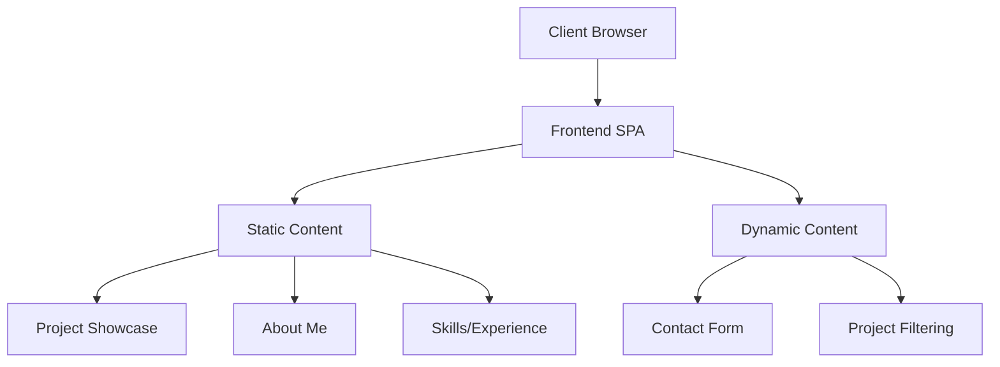
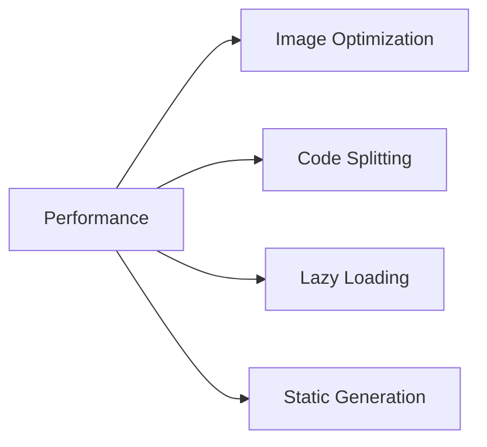
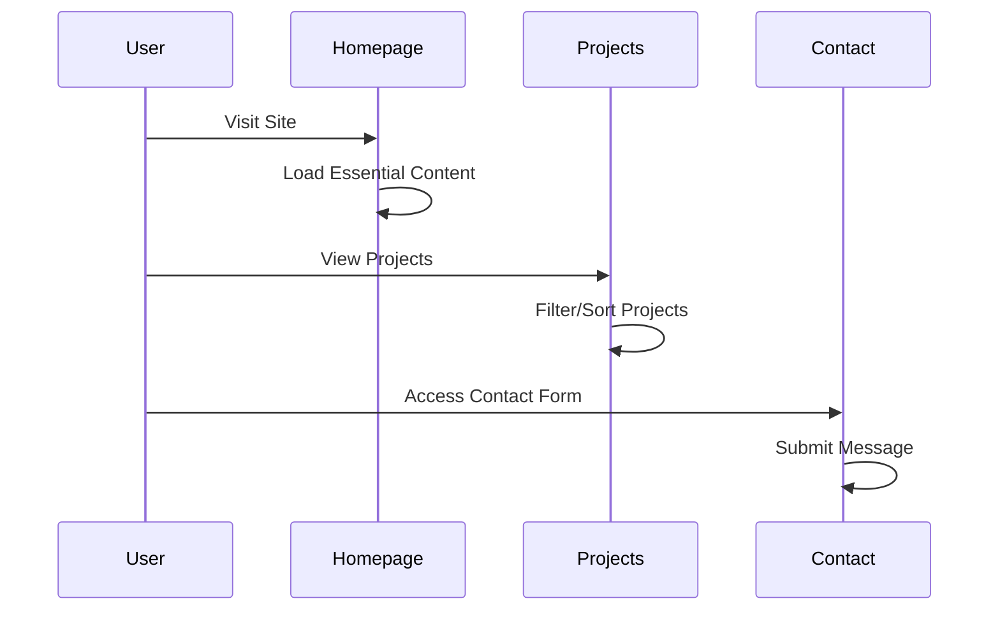

# Portfolio Website Architecture

## System Overview
The portfolio website will be built as a modern, responsive single-page application (SPA) with the following key architectural components:

## Core Components

### Frontend Architecture
- **React.js**: Main frontend framework
- **Next.js**: For server-side rendering and routing
- **TailwindCSS**: For styling and responsive design
- **Framer Motion**: For smooth animations and transitions

### Content Management
- Static content stored in markdown files
- Project data in structured JSON format
- Images and assets in optimized formats

### Performance Optimizations

## User Interface Flow

## Deployment Architecture
- Static site hosting on Vercel/Netlify
- CI/CD pipeline for automated deployments
- Content delivery through CDN
- Analytics and monitoring integration
