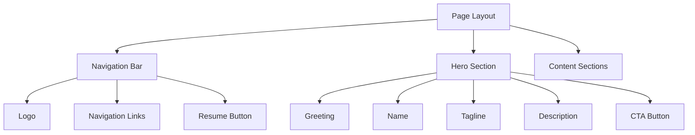
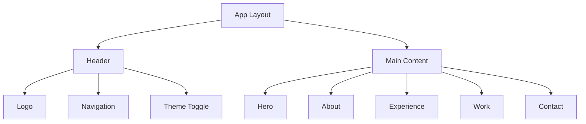
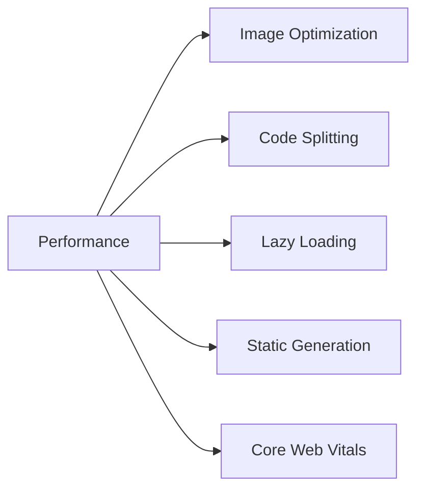

# Portfolio Website Architecture

## Design System
Based on the inspiration design, the website will follow these key design principles:

### Color Palette
```css
--navy-dark: #0a192f;     /* Dark background */
--slate-light: #8892b0;   /* Secondary text */
--mint-green: #64ffda;    /* Accent color */
--white: #e6f1ff;         /* Primary text */
```

### Typography
- **Primary Font**: Inter or SF Mono for modern, clean look
- **Heading Scale**: 
  - H1: 72px/4.5rem (Name)
  - H2: 48px/3rem (Section headers)
  - H3: 24px/1.5rem (Sub-headers)
- **Body Text**: 16px/1rem with 1.5 line height

### Layout System


## Core Components

### Frontend Architecture
- **React.js**: Main frontend framework
- **Next.js 15**: For server-side rendering and routing
  - Dynamic route parameters handled as Promises
  - Strict type checking for page props
  - Improved metadata handling
- **TailwindCSS**: For styling and responsive design
- **Framer Motion**: For smooth animations and transitions

### Component Structure


### Animation System
- Subtle fade-in animations on scroll
- Smooth hover transitions
- Text reveal animations
- Navigation highlight effects

### Responsive Design
- Mobile-first approach
- Breakpoints:
  - Mobile: < 640px
  - Tablet: 640px - 1024px
  - Desktop: > 1024px
- Collapsible navigation for mobile
- Fluid typography scaling

## Performance Optimizations


### Core Web Vitals Strategy
- **Largest Contentful Paint (LCP)**:
  - Preloaded critical fonts with font-display: swap
  - Optimized font loading with adjustFontFallback
  - Prioritized hero content loading
  - Improved initial render performance
- **First Input Delay (FID)**:
  - Optimized JavaScript execution patterns
  - Deferred non-critical theme initialization
  - Implemented useCallback for event handlers
  - Used requestIdleCallback for background tasks
- **Cumulative Layout Shift (CLS)**:
  - Added proper image aspect ratio containers
  - Prevented Flash of Unstyled Content (FOUC)
  - Optimized content visibility with CSS
  - Smooth loading transitions

### Image Optimization Strategy
- **Format Selection**:
  - WebP for photographs with alpha transparency
  - SVG for icons and vector graphics
  - PNG as fallback for older browsers
- **Responsive Images**:
  - Mobile: 640px
  - Tablet: 1024px
  - Desktop: 1920px
  - Retina: 2x resolution support
- **Loading Strategy**:
  - Priority loading for above-the-fold images
  - Lazy loading for below-the-fold content
  - Blur placeholder for smooth loading
  - Progressive loading for large images
- **Optimization Techniques**:
  - Automatic quality optimization
  - Size-appropriate format selection
  - Caching and CDN delivery
  - Preloading for critical images

## Accessibility Features
- ARIA labels for interactive elements
- Keyboard navigation support
- Color contrast compliance
- Screen reader optimization
- Focus state indicators

## Deployment Architecture
- Static site hosting on Vercel/Netlify
- CI/CD pipeline for automated deployments
- Content delivery through CDN
- Analytics and monitoring integration
